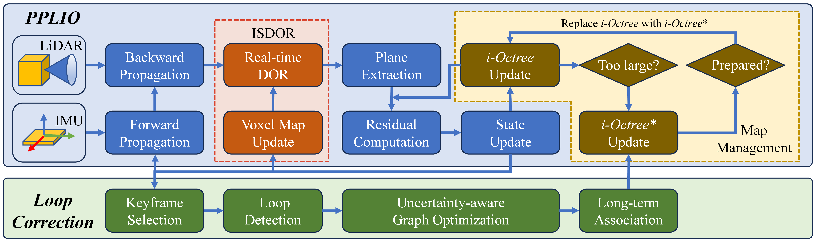

# SPLIN
## SPLIN: A Structured Plane-aware LiDAR-Inertial SLAM with Incremental Dynamic Object Removal and Covariance-aware Optimization 

## 1. Introduction
**SPLIN** a robust and efficient LiDAR-inertial SLAM framework featuring two key innovations. First, we introduce Incremental Static-referenced Dynamic Object Removal (ISDOR), a coarse-to-fine dynamic object removal strategy that incrementally constructs a voxel-based static map and detects dynamic objects at their first appearance, significantly enhancing front-end robustness while maintaining computational efficiency. Second, we propose a spherically-tessellated plane aggregation method tailored to LiDAR’s native radial geometry for efficient plane extraction, and a tightly coupled Point-Plane LiDAR-Inertial Odometry (PPLIO) system based on an iterated Kalman filter. This filter jointly models the Gaussian distribution of system states and residuals, enabling principled uncertainty propagation via cross-covariances and closed-form posterior updates. The back-end further integrates a covariance-aware factor graph where front-end uncertainty is preserved as information matrices, improving global consistency and long-term localization accuracy.

## 2. We will release the complete code upon acceptance of the paper.