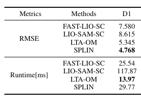
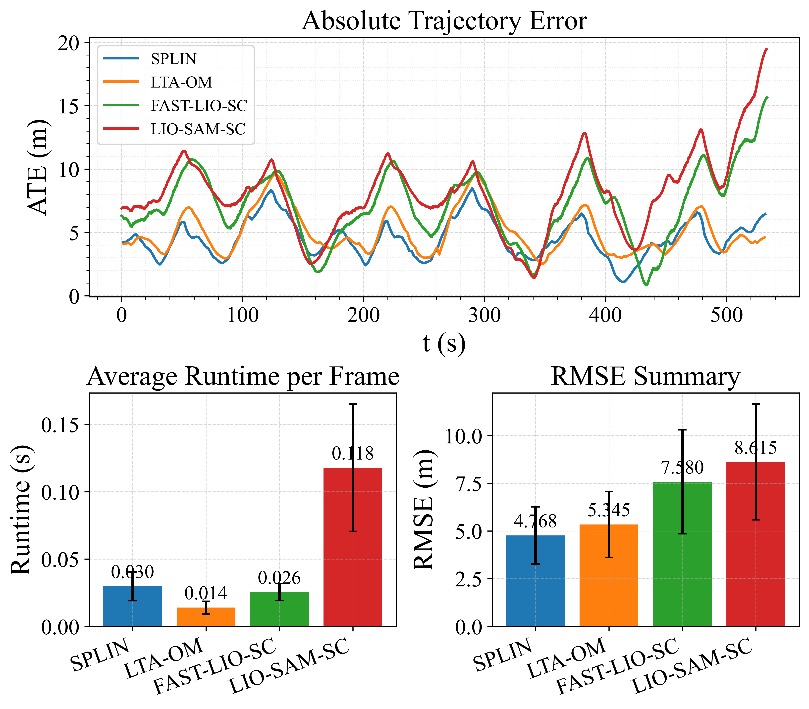
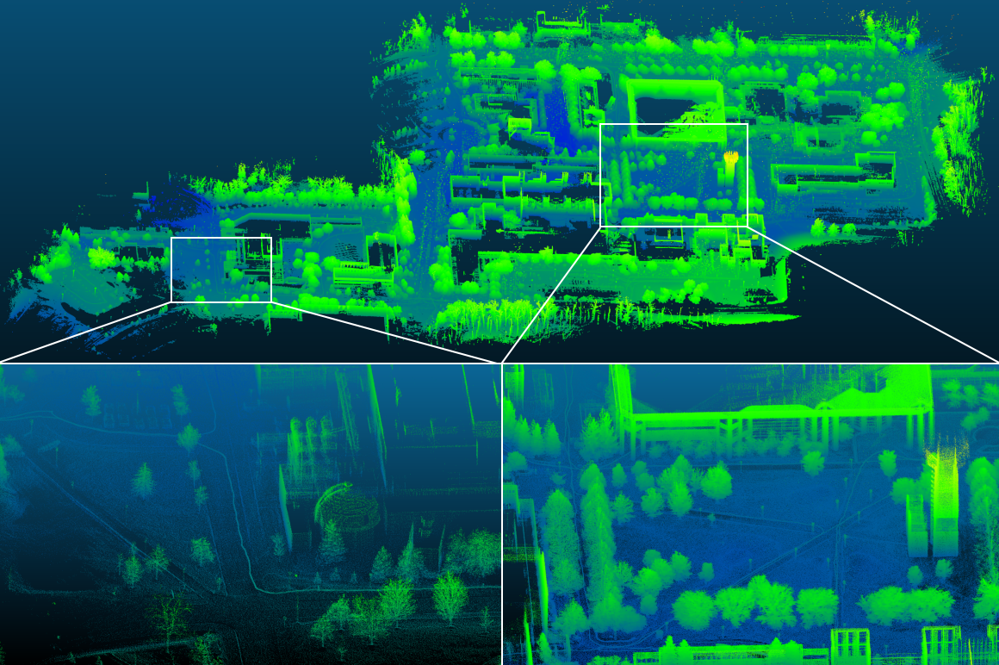

# SPLIN
## SPLIN: A Structured Plane-aware LiDAR-Inertial SLAM with Incremental Dynamic Object Removal and Covariance-aware Optimization 

## 1. Introduction
Accurate LiDAR-inertial SLAM in dynamic environments remains challenging due to transient moving objects and long-horizon drift accumulation. Point-only formulations offer weak structural constraints, while post-hoc dynamic filtering cannot promptly inform the frontend pose estimation and data association. To address these issues, we present SPLIN, a structured plane-based LiDAR-inertial SLAM framework that couples realtime dynamic suppression with uncertainty-consistent estimation. First, we introduce Incremental Static-referenced Dynamic Object Removal (ISDOR), a lightweight module that detects and suppresses moving objects upon their first appearance at the frame level. Second, we develop a real-time, tightly coupled Point-Plane LiDAR-Inertial Odometry (PPLIO) based on an iterated Kalman filter. PPLIO integrates ISDOR, an efficient plane extraction module, and an adaptive downsampling strategy, enabling robust operation across scenes with widely varying scales and dynamics. To mitigate long-term odometric drift, we further employ uncertainty-aware factor-graph optimization in the backend, yielding a complete, accurate, and efficient LiDAR-inertial SLAM system. Extensive experiments demonstrate the effectiveness of SPLIN: ISDOR yields, on average, a 13.47% F1 improvement (best F1 on 15/17 sequences), a 26.67% precision gain, and a 64.26% reduction in runtime over state-of-the-art baselines. Building on ISDOR, SPLIN achieves the lowest localization error on 28/34 sequences—including highly dynamic and low-feature environments—while maintaining real-time inference at 6.94-36ms per frame. Ablation studies further validate the contributions of ISDOR and the loop closure strategy to the overall system accuracy
<div align="center">

</div>

## 2. We will release the complete code upon acceptance of the paper.

## 3. Evaluation
Run:
```shell
python eval_rmse.py  
```
Expected output:
```c
data_dir:  eval_data/MulRan/DCC01
['poses_gt.txt', 'poses_fast_lio_sc.txt', 'poses_lio_sam_sc.txt', 'poses_ltaom.txt', 'poses_splin.txt']
rmses:  [0.0, 7.580212, 8.615076, 5.344614, 4.768432]
alg_names:  ['fast_lio_sc', 'lio_sam_sc', 'ltaom', 'splin']
excu_time:  [25.542918725171543, 117.86952996389891, 13.969675573208159, 29.773599097146985]
GT          :  4.610385564963174e-10
FAST-LIO-SC :  7.580212541411045
LIO-SAM-SC  :  8.615076866506188
LTA-OM      :  5.344615362293383
SPLIN       :  4.768434514692518
```
<!-- <div align="center">

</div> -->
<div align="center">
<div style="color:orange; border-bottom: 1px solid #d9d9d9;
    display: inline-block;
    color: #999;
    padding: 2px;">ATE, RMSE, and runtime comparison on the MulRan dataset (DCC01 sequence). </div>


</div>


<div align="center">
<div style="color:orange; border-bottom: 1px solid #d9d9d9;
    display: inline-block;
    color: #999;
    padding: 2px;">Mapping result of SPLIN on the NCLT dataset (2012-01-15 sequence).</div>

</div>

## 4. Acknowledgments
Thanks to Fu Zhang, et al. for open-sourcing their excellent work [LTAOM](https://github.com/hku-mars/LTAOM/tree/main) and [R3LIVE](https://github.com/hku-mars/r3live).

## License
The source code is released under [GPLv2](http://www.gnu.org/licenses/) license.