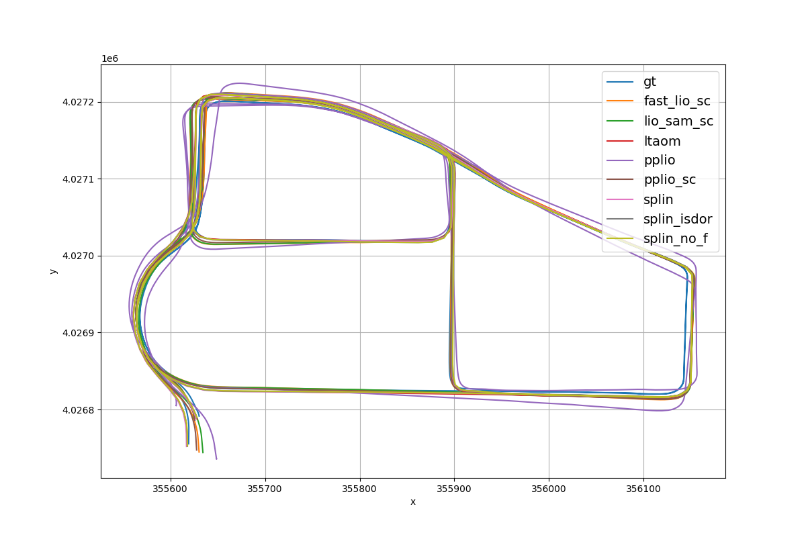
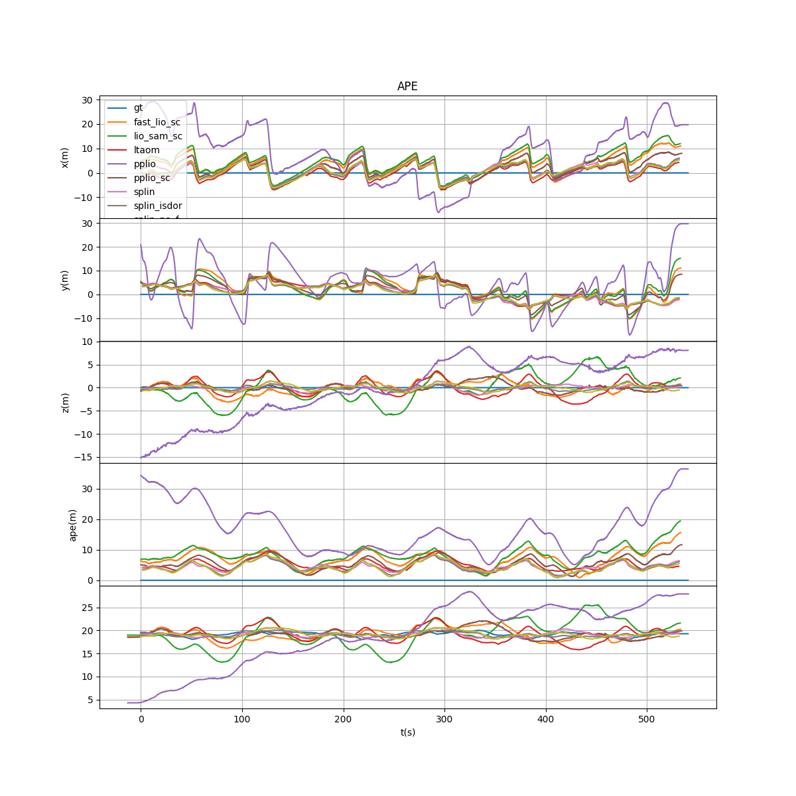

# SPLIN
## SPLIN: A Structured Plane-aware LiDAR-Inertial SLAM with Incremental Dynamic Object Removal and Covariance-aware Optimization 

## 1. Introduction
**SPLIN** a robust and efficient LiDAR-inertial SLAM framework featuring two key innovations. First, we introduce Incremental Static-referenced Dynamic Object Removal (ISDOR), a coarse-to-fine dynamic object removal strategy that incrementally constructs a voxel-based static map and detects dynamic objects at their first appearance, significantly enhancing front-end robustness while maintaining computational efficiency. Second, we propose a spherically-tessellated plane aggregation method tailored to LiDAR’s native radial geometry for efficient plane extraction, and a tightly coupled Point-Plane LiDAR-Inertial Odometry (PPLIO) system based on an iterated Kalman filter. This filter jointly models the Gaussian distribution of system states and residuals, enabling principled uncertainty propagation via cross-covariances and closed-form posterior updates. The back-end further integrates a covariance-aware factor graph where front-end uncertainty is preserved as information matrices, improving global consistency and long-term localization accuracy.
<div align="center">

</div>

## 2. We will release the complete code upon acceptance of the paper.

## 3. Evaluation
Run:
```shell
python eval_rmse.py  
```
Expected output:
```c
data_dir:  eval_data/MulRan/DCC01
['poses_fast_lio_sc.txt', 'poses_gt.txt', 'poses_lio_sam_sc.txt', 'poses_ltaom.txt', 'poses_pplio.txt', 'poses_pplio_sc.txt', 'poses_ppsam.txt', 'poses_ppsam_isdor.txt', 'poses_ppsam_no_f.txt']
time_len:  [546.1032583713531, 540.5850977897644, 545.9923703670502, 531.5999147891998, 553.6950016021729, 547.0950453281403, 531.9999170303345, 531.9999170303345, 531.9999170303345]
rmses:  [7.580212, 0.0, 8.615076, 5.344614, 18.378185, 5.996756, 4.768432, 4.647011, 4.72644]
alg_names:  ['fast_lio_sc', 'lio_sam_sc', 'ltaom', 'pplio', 'pplio_sc', 'ppsam', 'ppsam_isdor', 'ppsam_no_f']
excu_time:  [25.542918725171543, 117.86952996389891, 13.969675573208159, 37.19252968580715, 36.549721903214156, 29.773599097146985, 34.22086161068978, 15.801903268327917]
fast_lio_sc :  7.580212541411045
gt          :  4.610385564963174e-10
lio_sam_sc  :  8.615076866506188
ltaom       :  5.344615362293383
pplio       :  18.417946893761584
pplio_sc    :  5.996755741603469
ppsam       :  4.768434514692518
ppsam_isdor :  4.6470100403271415
ppsam_no_f  :  4.7264428700106444
```
<div align="center">

</div>
<div align="center">

</div>